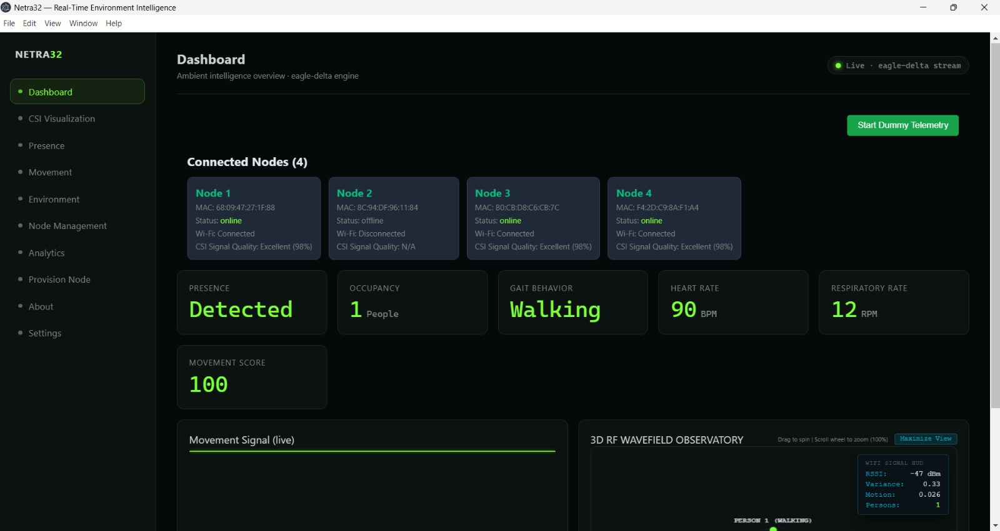
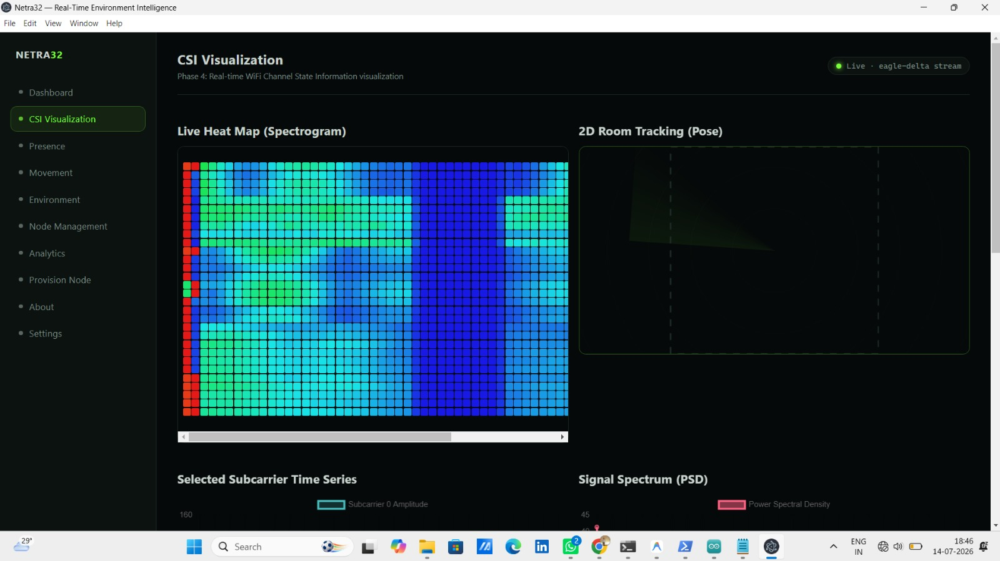

# Netra32 — Real-Time Wi-Fi RF Environment Intelligence & Pose Fusion

Netra32 is a non-invasive device-free indoor environment monitoring system. By processing **Wi-Fi Channel State Information (CSI)** amplitudes captured from standard ESP32 transmitter/receiver nodes, Netra32 performs real-time human occupancy counting, gait classification (Walking, Sitting, Standing, Empty), and 3D skeleton pose reconstruction without using optical cameras.

---

## 📋 System Prerequisites (For Presentation PC)

Before launching the project, ensure the following software is installed on the host computer:

### 1. Node.js (LTS Version 18 or newer)
* **Purpose:** Runs the Node.js backend telemetry server and hosts the Electron Desktop client application.
* **Download:** [nodejs.org](https://nodejs.org/)

### 2. Python (Version 3.9 - 3.11)
* **Purpose:** Runs the DSP signal processing engine (`signal_processor.py`) for spectral density and variance calculation.
* **Required Libraries:** Install via terminal/command prompt:
  ```bash
  pip install numpy scipy
  ```

### 3. USB-to-UART Serial Drivers
* **Purpose:** Required for Windows to recognize connected ESP32 nodes via USB cables.
* **Drivers:** CH340 or CP2102 drivers (usually installed automatically by Windows Update when plugged in).

---

## 🚀 Quick Start Guide (One-Click Launch)

You do **not** need to use PowerShell or type commands to start the project. Follow these steps:

1. Connect your ESP32 hardware nodes to the power supply or PC USB ports.
2. Open the **`eagle-delta-fresh`** project folder.
3. Double-click the **`Launch Netra32.bat`** file located in the root directory.
4. **Boot Phase:** A minimized terminal will launch the Node.js backend server, wait 4 seconds for the Python AI Engine to initialize, and then automatically launch the **Netra32 Desktop App**.
5. **Clean Exit:** Closing the Netra32 application window will automatically shut down the background server and release network ports.

---

## 🛠️ Hardware Setup & Troubleshooting

### ⚡ Node Auto-Disconnect / Boot Failures
* **Symptoms:** A node disconnects after 1-2 minutes of operation, or does not start up automatically when the main power is turned on.
* **Root Cause (Power Brownout):** Wi-Fi transmission at 20Hz causes high current spikes (~450mA). Direct 5V power wiring or slow-rising power supply voltages can cause the ESP32 to miss its internal Power-On Reset (POR) trigger and freeze.
* **The Hardware Fix:** Solder or connect a small **`10uF` capacitor** directly between the **`EN` (Reset) pin** and **`GND` pin** of the ESP32. This delays the boot sequence until the voltage is fully stable, ensuring the nodes boot **100% automatically** on power-up.

---

## 🧠 AI Engine & 3D View Calibration

* **Occupancy Counting (0 - 4 People):** Processes subcarrier variances using an **Exponential Moving Average (EMA)** filter to prevent count flickering.
  * Empty: $< 150$ total variance
  * 1 Person: $150$ to $2800$ total variance
  * 2 People: $2800$ to $6500$ total variance
  * 3 People: $6500$ to $12000$ total variance
  * 4 People: $> 12000$ total variance
* **Gait Classification:** Categorizes movement states into `Standing`, `Walking` (animates out-of-phase skeleton arm/leg strides and head bobs), and `Sitting` (drops hip joints and bends knees forward with hands on thighs).
* **3D View Interaction:** Hover over the 3D Wavefield card and scroll your **mouse wheel** to zoom. Click **Maximize View** to toggle fullscreen. Drag to spin the viewport.
* **2D Room Tracking:** The CSI visualization page features a 2D radar scope plotting real-time joint positions.


## ✨ Features

- 📡 ESP32 CSI Data Collection
- 🌐 Fully Offline Architecture
- ⚡ Real-Time Data Streaming
- 📊 Interactive Dashboard
- 💾 Local Database Storage
- 🔌 REST API
- 📈 Signal Visualization
- 🖥️ Modern Responsive Frontend
- 🔒 Privacy-Focused (No Cloud Required)

---

##🖥️ Dashboard Overview



* **EAGLE DELTA** is an advanced real-time surveillance and target monitoring platform designed for rapid situational awareness. The dashboard combines live sensor feeds, 3D tactical visualization, heatmaps, and intelligent threat analysis to provide operators with a comprehensive operational picture.

---

## 🔥 Dynamic Heatmap



Visualizes areas of high target concentration and activity intensity using color gradients. Heatmaps help identify hotspots, movement patterns, and regions requiring immediate attention.


